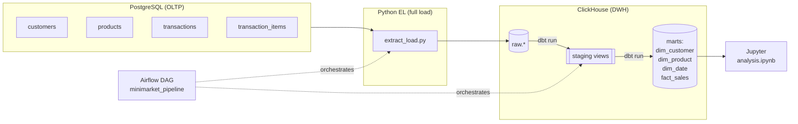

# Minimarket ELT Pipeline — Data Engineer Technical Test (Beginner + Intermediate)

End-to-end **ELT pipeline** for a minimarket Point-of-Sale system:
**PostgreSQL (OLTP) → ClickHouse (Data Warehouse) → dbt (star schema) → Airflow (orchestration) → Jupyter (analytics)** — all running in Docker Compose.

- **Pipeline language:** Python (psycopg2 / SQLAlchemy + clickhouse-connect)
- **Mode:** Full-load, single tenant
- **Warehouse:** ClickHouse (fully local — no GCP credentials needed)
- **Transform:** dbt Core (`dbt-clickhouse`)
- **Orchestration:** Apache Airflow 2.9 (LocalExecutor)
- **Visualization:** Jupyter Notebook (matplotlib + seaborn)

---

## Architecture



**Airflow DAG:** `extract_load` → `dbt_run` → `dbt_test`

**Star schema (marts):**

```
                    ┌──────────────┐
                    │  dim_date    │
                    └──────┬───────┘
                           │
┌──────────────┐    ┌──────▼────────┐    ┌──────────────────┐
│ dim_customer │────│  fact_sales   │────│   dim_product    │
└──────────────┘    └───────────────┘    └──────────────────┘
```

---

## Project structure

```
.
├── docker-compose.yml          # full stack
├── .env.example                # env template (defaults already baked in)
├── postgres/init/01_schema.sql # OLTP schema (auto-run on first boot)
├── pipeline/
│   ├── extract_load.py         # Python full-load EL (Postgres -> ClickHouse raw)
│   ├── seed_data.py            # Faker-based seed generator
│   └── requirements.txt
├── dbt/minimarket/             # dbt project
│   ├── dbt_project.yml
│   ├── profiles.yml
│   ├── macros/generate_surrogate_key.sql
│   └── models/
│       ├── staging/            # stg_* views + sources + tests
│       └── marts/              # dim_* / fact_sales + tests
├── airflow/dags/minimarket_pipeline.py
├── notebooks/analysis.ipynb    # 3 analytical questions + charts
├── docker/airflow/Dockerfile   # Airflow image + isolated dbt venv
├── docker/jupyter/Dockerfile
└── scripts/run_seed.sh         # populate seed data
```

---

## How to run (from scratch)

> Requires Docker + Docker Compose v2. First build takes a few minutes.

### 1. Start the stack

```bash
docker compose up -d --build
```

This launches PostgreSQL, ClickHouse, Airflow (init + webserver + scheduler), and Jupyter.
Wait until `docker compose ps` shows the airflow services healthy (~1–2 min).

### 2. Seed the OLTP source

```bash
./scripts/run_seed.sh
```

Generates ~300 customers, ~90 products, ~6,000 transactions (and items) across ~12 months.

### 3. Run the pipeline

Open **Airflow** at <http://localhost:8080> (login `admin` / `admin`), then trigger the
**`minimarket_pipeline`** DAG. It runs:

```
extract_load  ->  dbt_run  ->  dbt_test
```

(Or trigger from the CLI:)

```bash
docker compose exec airflow-scheduler airflow dags trigger minimarket_pipeline
```

### 4. Explore the analytics

Open **Jupyter** at <http://localhost:8888> → `analysis.ipynb` → Run All.
It connects straight to ClickHouse and renders the three charts.

### 5. (Optional) dbt docs

```bash
docker compose exec airflow-scheduler bash -lc \
  "cd /opt/airflow/dbt/minimarket && /opt/dbt-venv/bin/dbt docs generate --profiles-dir ."
```

---

## Service endpoints

| Service     | URL / Port                | Credentials      |
|-------------|---------------------------|------------------|
| Airflow UI  | http://localhost:8080     | admin / admin    |
| Jupyter Lab | http://localhost:8888     | (no token)       |
| PostgreSQL  | localhost:5432            | minimarket / minimarket |
| ClickHouse  | localhost:8123 (HTTP), 9000 (native) | default / (no password) |

---

## dbt models

| Layer   | Model                    | Description                                  |
|---------|--------------------------|----------------------------------------------|
| staging | `stg_customers`          | Clean & rename customers                      |
| staging | `stg_products`           | Clean & rename products                       |
| staging | `stg_transactions`       | Clean, filter `status = 'completed'`          |
| staging | `stg_transaction_items`  | Clean line items                              |
| mart    | `dim_customer`           | Customer dimension                            |
| mart    | `dim_product`            | Product dimension (with category)             |
| mart    | `dim_date`               | Date dimension (generated from txn range)     |
| mart    | `fact_sales`             | Sales fact at line-item grain                 |

Tests in `schema.yml`: `not_null`, `unique`, `relationships`, `accepted_values`.

---

## Analytical questions (in `analysis.ipynb`)

1. **Top 5 products per category** — grouped horizontal bar charts
2. **Monthly revenue trend** — line chart
3. **Payment-method distribution** — donut chart

---

## Walkthrough video Beginner Level

> YouTube link:
> **https://youtu.be/Iv6rHv0v2SM**

---

## Notes on design choices

- **ClickHouse over BigQuery** so the whole stack is self-contained and runs with a single
  `docker compose up` — no GCP account or service-account keys required.
- **Full-load** EL drops & recreates each `raw` table per run; correct and simple for the
  beginner scope (idempotent).
- **dbt in an isolated virtualenv** inside the Airflow image to avoid dependency conflicts
  between dbt and Airflow.
- **`dim_date` generated natively** in ClickHouse (`range()` + `array join`), no extra packages.

---

# Intermediate Level — Multi-tenant, Incremental, Dashboard

The intermediate level extends the beginner pipeline. It lives in the **same repo**
and the **same dbt project**, separated by dbt **tags** so each level builds
independently:

- `tag:beginner` → `models/staging/` + `models/marts/` (single tenant, full-load source `raw`)
- `tag:intermediate` → `models/staging_mt/` + `models/marts_mt/` (multi-tenant source `raw_mt`)

## What changes vs Beginner

| Aspect | Beginner | Intermediate |
|---|---|---|
| Language | Python (full-load) | Python (concurrent + incremental) |
| Concurrency | — | `ThreadPoolExecutor`, one worker per tenant (goroutine + `WaitGroup` equivalent) |
| Tenancy | 1 tenant (`public` schema) | 3 tenants = 3 Postgres schemas (`tenant_jakarta`, `tenant_bandung`, `tenant_surabaya`) |
| Load mode | Full-load (DROP + reload) | Incremental via per-(tenant,table) **watermark** on `updated_at` (JSON file) |
| Raw landing | `raw` (MergeTree) | `raw_mt` (`ReplacingMergeTree(updated_at)`, dedup on `(tenant_id, pk)`) |
| dbt models | 4 staging + 4 marts | +8 staging, +7 marts (incl. `dim_store`, `dim_promotion`, `fct_sales`, `fct_promotion_usage`) |
| Data quality | `not_null`, `unique` | + `relationships`, `accepted_values` |
| Viz | Jupyter notebook | FastAPI (5 endpoints) + HTML dashboard (Chart.js) |

## Concurrency mapping (Python instead of Golang)

The brief shows a Golang goroutine + `sync.WaitGroup` pattern. The Python equivalent
used here:

- **goroutine per tenant** → `ThreadPoolExecutor(max_workers=n_tenants)` submitting one
  `process_tenant()` task per tenant.
- **`wg.Wait()`** → leaving the `with ThreadPoolExecutor(...)` block (joins all workers).
- Work is I/O-bound (DB round-trips), so threads give real overlap despite the GIL.
- Each worker owns its own Postgres + ClickHouse connections; the main thread merges and
  writes the watermark file after all workers finish (no write races).

## Incremental load (watermark)

- State file: `state/watermarks.json` (mounted into Airflow at `/opt/airflow/state`).
- Shape: `{ tenant_id: { table: "YYYY-MM-DD HH:MM:SS" } }`.
- Each run pulls only rows with `updated_at > watermark`, appends to `raw_mt`, then
  advances the watermark to the max `updated_at` seen.
- `ReplacingMergeTree(updated_at)` + `FINAL` in staging collapses re-loaded/updated rows
  to the latest version, so reruns are idempotent.

## Intermediate dbt models

| Layer | Models |
|---|---|
| staging_mt | `stg_customers_mt`, `stg_products_mt`, `stg_transactions_mt`, `stg_transaction_items_mt`, `stg_stores`, `stg_promotions`, `stg_transaction_promotions`, `stg_suppliers` |
| marts_mt | `dim_customer_mt`, `dim_product_mt`, `dim_date_mt`, `dim_store`, `dim_promotion`, `fct_sales`, `fct_promotion_usage` |

`fct_sales` is at transaction-item grain, enriched with `tenant_id` and `store_id`.
Promotion economics live in their own fact, `fct_promotion_usage` (grain = transaction ×
promo, carries `discount_applied` and `transaction_total`) — cleaner than overloading the
item-grain fact, and lets Q2 use **two facts**.

## Analytical questions (Intermediate)

1. **Revenue per store per month** (last 6 months) — `fct_sales` × `dim_store` × `dim_date_mt`
2. **Promotion effectiveness** — top promos by total discount + avg transaction value
   promo vs non-promo (`fct_promotion_usage` + `fct_sales`)
3. **Top 3 products per city** by revenue
4. **Customer spending segmentation** (High/Medium/Low) per city
5. **Day-of-week analysis** — transaction count + revenue

## Dashboard

- FastAPI service in `dashboard/app.py` exposes 5 endpoints (one per question) querying
  the `analytics` marts.
- `dashboard/static/index.html` is a simple white + red themed dashboard (Chart.js via CDN)
  that consumes those endpoints. The FE framework is intentionally minimal — it is a
  deliverable, not a graded focus.
- Served at **http://localhost:8000**.

| Endpoint | Question |
|---|---|
| `GET /api/revenue-by-store` | Q1 |
| `GET /api/promotion-effectiveness` | Q2 |
| `GET /api/top-products-by-city` | Q3 |
| `GET /api/customer-segments` | Q4 |
| `GET /api/transactions-by-day` | Q5 |

## How to run — full stack (Beginner + Intermediate)

Because the intermediate level adds new schemas, a ClickHouse password, and the `raw_mt`
database, start from a clean state:

```bash
docker compose down -v
docker compose up -d --build
```

Seed **both** sources (single-tenant + multi-tenant):

```bash
# beginner (single tenant)
docker compose exec -T airflow-scheduler python /opt/airflow/pipeline/seed_data.py
# intermediate (3 tenants)
docker compose exec -T airflow-scheduler python /opt/airflow/pipeline/seed_data_multitenant.py
```

Trigger the DAGs (Airflow UI at http://localhost:8080, admin/admin), or via CLI:

```bash
docker compose exec -T airflow-scheduler airflow dags trigger minimarket_pipeline
docker compose exec -T airflow-scheduler airflow dags trigger minimarket_intermediate_pipeline
```

Then:

- Beginner analytics → Jupyter at http://localhost:8888 (`notebooks/analysis.ipynb`)
- Intermediate dashboard → http://localhost:8000

To demo incremental load: insert/update a few source rows (any tenant schema), re-trigger
`minimarket_intermediate_pipeline`, and observe only changed rows being loaded (see task
logs for `+N rows` per table).

---

## Walkthrough video Intermediate Level

> YouTube link:
> **https://youtu.be/fWRc7VfsKDE**

---

## Intermediate service endpoints

| Service | URL |
|---|---|
| Airflow | http://localhost:8080 (admin/admin) |
| Jupyter | http://localhost:8888 |
| Dashboard (FastAPI + UI) | http://localhost:8000 |
| ClickHouse HTTP | http://localhost:8123 |
| PostgreSQL | localhost:5432 |
